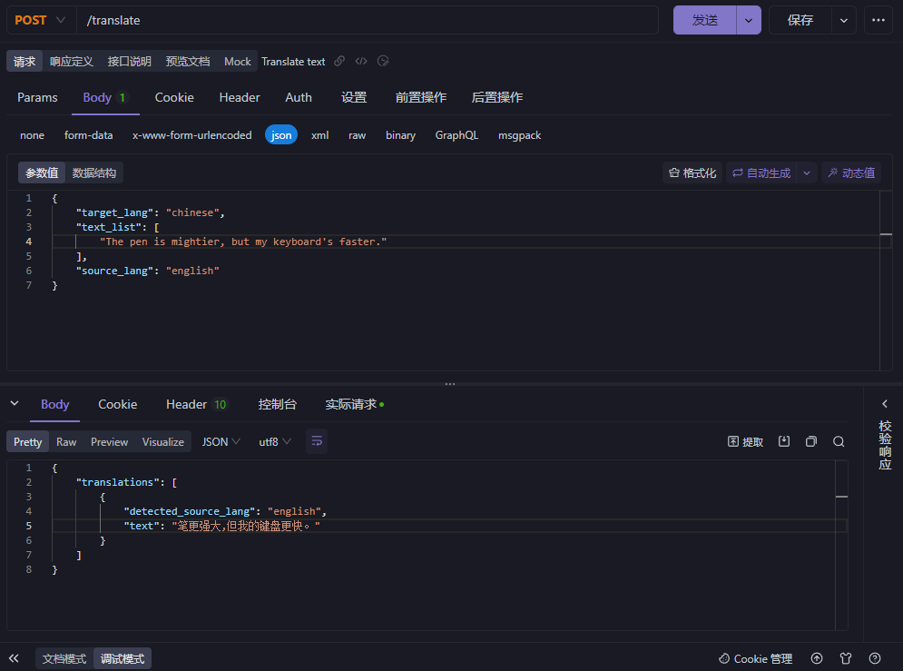
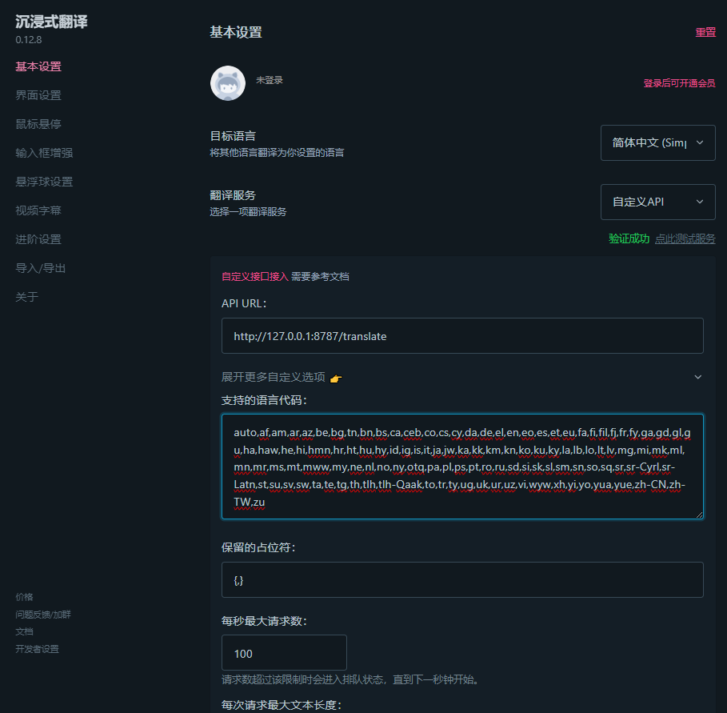

# "Immersive Translation" Custom Workers Ai Translation API

- Custom API based on [Cloudflare Workers Ai](https://developers.cloudflare.com/workers-ai/models/translation/) for "Immersive Translation"
- Model used: `@cf/meta/m2m100-1.2b`

## Authentication Method

- Add an environment variable during deployment, with the key name `URL_PREFIX`
  - For example: `URL_PREFIX` = `/translate`
  - In this case, the API URL should be set as https://[Workers Domain]/translate

